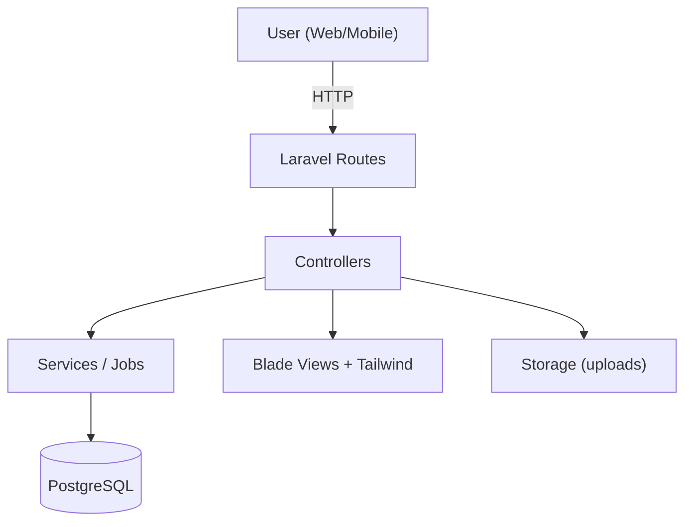
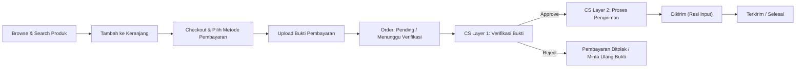
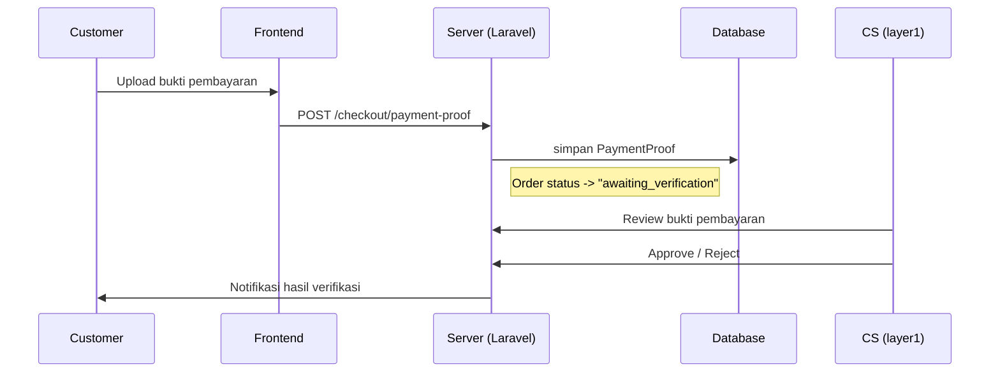
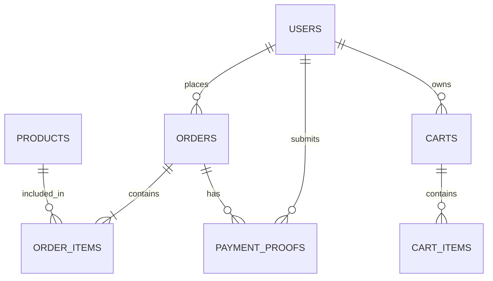

# Simple Online Store - Multi Management System

Laravel 12 · PostgreSQL · E-commerce · RBAC · Manual Payment Verification

Simple Online Store adalah template aplikasi e-commerce berbasis Laravel 12 yang dirancang untuk usaha kecil-menengah. Aplikasi ini menyediakan katalog produk, keranjang belanja, checkout, upload bukti pembayaran, serta alur verifikasi dua-lapis oleh Customer Service. Cocok untuk toko online yang membutuhkan proses pembayaran manual yang rapi dan aman.

Klik bintang jika project ini membantu Anda.

---

**Ringkasan Cepat**
- Jenis aplikasi: E-commerce (toko online)
- Fokus utama: verifikasi pembayaran manual, multi-role management
- Target pengguna: UMKM, developer pemula, startup kecil

---

**Fitur Utama**
- Katalog produk dan detail produk
- Keranjang belanja dan checkout
- Upload bukti pembayaran dan verifikasi dua-lapis
- Manajemen order dan status pengiriman
- Role-Based Access Control: Admin, CS Layer 1, CS Layer 2, Customer
- Optimasi untuk PostgreSQL
- Penyimpanan file terhubung (storage public)

---

**Peran Pengguna**
- Customer: belanja, checkout, upload bukti pembayaran
- CS Layer 1: verifikasi bukti pembayaran
- CS Layer 2: proses pengiriman dan update status
- Admin: kelola produk, pengguna, dan order

---

**Teknologi**
- Laravel 12
- PostgreSQL
- Blade + Tailwind CSS
- Alpine.js

---

**Tech Stack Icons**


---

**Persyaratan**
- PHP >= 8.1
- Composer
- Node.js >= 16
- PostgreSQL

---

**Instalasi Cepat (Windows - PowerShell)**
Jalankan perintah di root project (folder yang berisi file `artisan`).

```powershell
# Install dependency PHP
composer install

# Install dependency JS dan build assets
npm install
npm run build

# Salin file environment dan generate app key
copy .env.example .env
php artisan key:generate

# Atur koneksi database PostgreSQL di .env
# DB_CONNECTION=pgsql
# DB_HOST=127.0.0.1
# DB_PORT=5432
# DB_DATABASE=nama_database
# DB_USERNAME=username
# DB_PASSWORD=password

# Jalankan migrasi
php artisan migrate

# (Opsional) Seed data
php artisan db:seed

# Link storage
php artisan storage:link

# Jalankan server lokal
php artisan serve
```

---

**Konfigurasi .env (Minimum)**
Pastikan nilai berikut di file `.env` sudah benar:
- `APP_URL`
- `DB_CONNECTION=pgsql`
- `DB_HOST`
- `DB_PORT`
- `DB_DATABASE`
- `DB_USERNAME`
- `DB_PASSWORD`

---

**Akun Demo (Jika Seed Data Aktif)**
Jika Anda menjalankan `php artisan db:seed`, Anda bisa memakai akun demo.
- Admin: `admin@example.com`
- CS Layer 1: `cs1@example.com`
- CS Layer 2: `cs2@example.com`
- Customer: `customer@example.com`
- Password semua akun: `password123`

---

**Struktur Folder Penting**
- `app/` logic utama aplikasi
- `resources/views/` tampilan Blade
- `routes/` definisi routing
- `database/migrations/` skema database
- `storage/` file upload dan cache

---

**Diagram & Flow**

Flow aplikasi (arsitektur singkat):


Flow bisnis (order lifecycle):


Flow verifikasi pembayaran (sequence):


Struktur data utama (ringkas):


---

**Catatan Deploy**
Untuk production, gunakan:
- `APP_ENV=production`
- `APP_DEBUG=false`
- Jalankan `php artisan config:cache` dan `php artisan route:cache`

---


Laravel e-commerce, Laravel 12, online store, PostgreSQL, RBAC, payment verification, manual payment, UMKM, multi-role, checkout system, inventory management, order management, customer service workflow.

---

**Lisensi**
MIT
