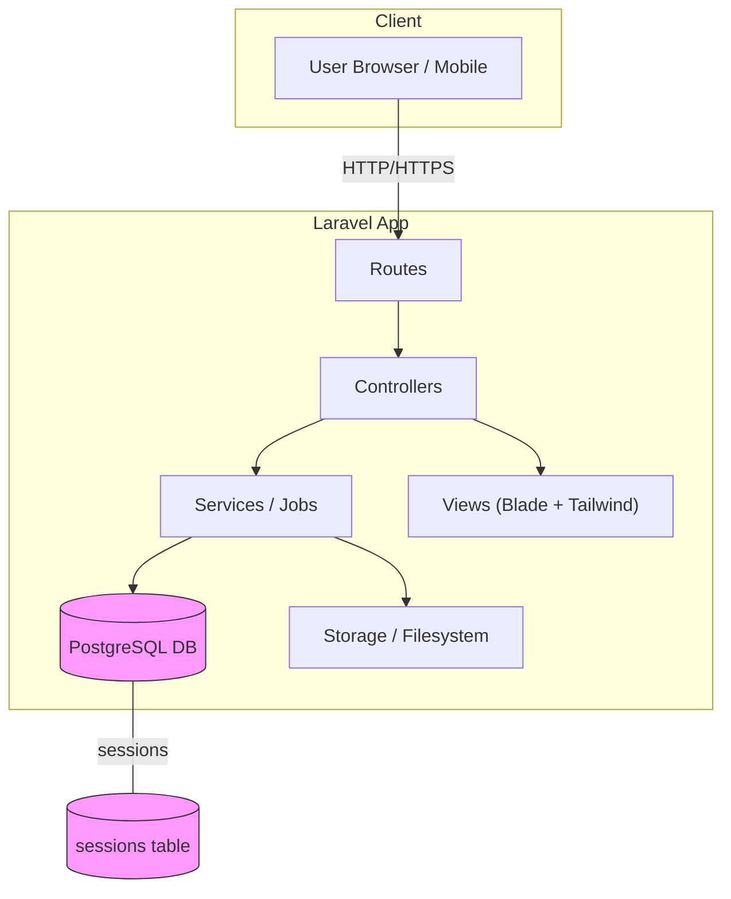
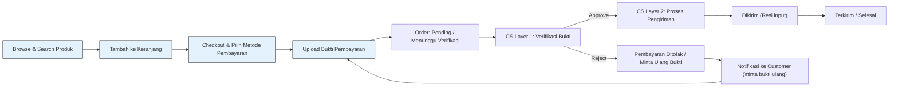
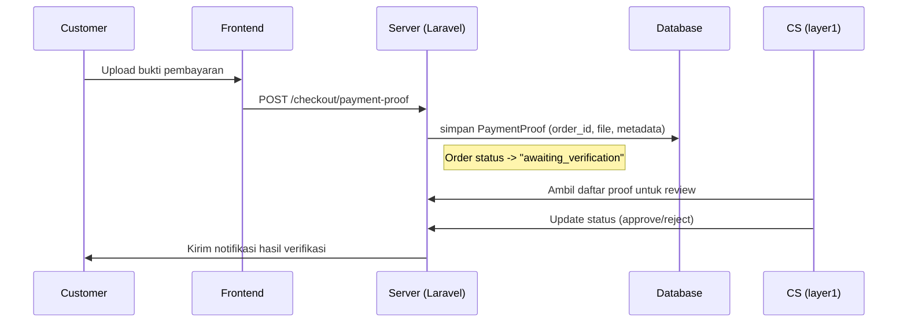
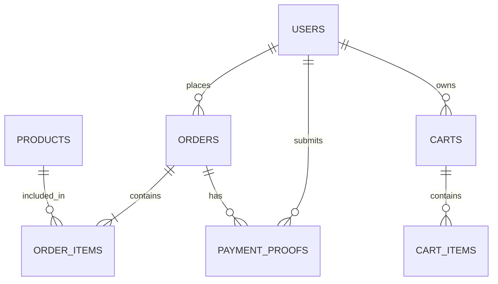
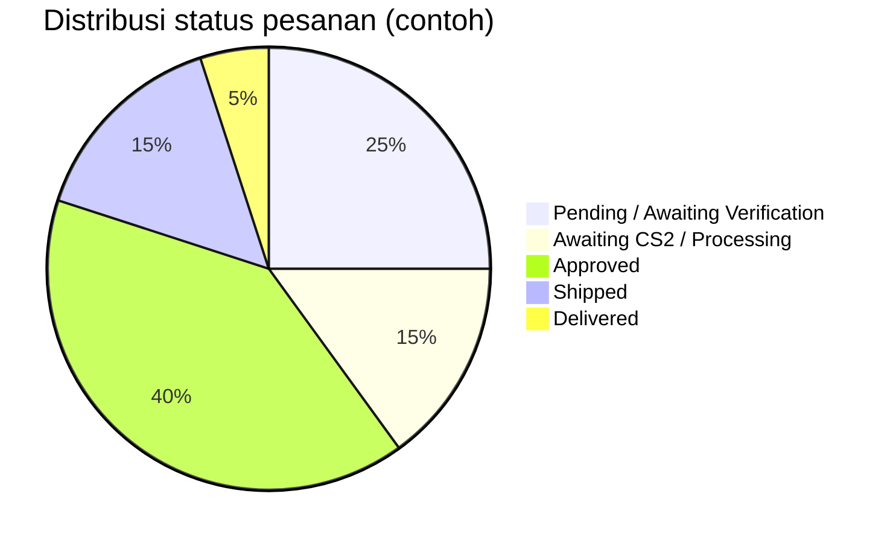

# Simple Online Store — Multi Management System

Laravel 12 · PostgreSQL · E-commerce · RBAC · Manual Payment Verification

Repository ini adalah template e-commerce terstruktur untuk usaha kecil-menengah yang membutuhkan alur multi-role (Customer, Admin, Customer Service), verifikasi pembayaran manual dua-lapisan, dan optimasi untuk PostgreSQL.

Klik ⭐ jika Anda menyukai project ini

---

## Ringkasan singkat 

Simple Online Store adalah boilerplate e-commerce berbasis Laravel 12 yang siap produksi: katalog produk, keranjang, checkout dengan upload bukti pembayaran, manajemen pesanan, dan alur verifikasi pembayaran dua-level. Cocok untuk merchant yang ingin cepat deploy toko online dengan alur verifikasi manual.

Keywords: Laravel 12, online store, e-commerce, PostgreSQL, RBAC, pembayaran manual, verifikasi pembayaran, Laravel starter.

---

## Fitur Utama

- Arsitektur Laravel yang rapi dan modular
- Role-Based Access Control (Customer, Admin, CS layer 1, CS layer 2)
- Alur checkout + upload bukti pembayaran (manual approval)
- Manajemen produk: CRUD, import dari Excel
- Optimasi PostgreSQL untuk performa dan indexing
- Penanganan order, pengiriman, dan pelacakan status pesanan
- Storage terhubung (disk publik) dan helper untuk download/upload

---

## Alur dan Arsitektur


 
---

## Diagram: Cara kerja toko (business flow)

Berikut beberapa diagram yang menjelaskan proses bisnis toko — fokus pada alur order, verifikasi pembayaran, struktur data utama, dan contoh statistik operasional. Diagram ini membantu developer dan pemilik bisnis memahami bagaimana request pengguna mengalir sampai pesanan diproses.

### 1) Order lifecycle (flowchart)



Keterangan singkat:
- Setelah upload bukti, order berada pada status pending sampai CS layer 1 memverifikasi.
- Jika terverifikasi, proses pengiriman dilakukan oleh CS layer 2; jika ditolak, customer diminta meng-upload ulang bukti.

### 2) Verifikasi pembayaran (sequence diagram)



Penjelasan:
- Sequence menunjukkan langkah teknis bisnis (apa yang dilakukan pengguna dan CS) tanpa membahas detail framework.

### 3) Struktur data utama (ER diagram, ringkas)



Catatan: ER diagram di atas adalah ringkasan; cek folder `database/migrations` untuk skema kolom lengkap.

### 4) Contoh statistik operasional (pie chart)



Penjelasan:
- Statistik di atas hanyalah contoh ilustratif. Untuk statistik nyata, hubungkan aplikasi dengan analytics (database query, Prometheus, atau BI tools) dan tampilkan angka aktual.

---

Jika Anda ingin, saya bisa:
- Mengganti angka pada pie chart dengan nilai nyata dari database (saya bisa tuliskan query contoh untuk PostgreSQL).
- Menambahkan diagram swimlane untuk memperlihatkan tanggung jawab (Customer / CS1 / CS2 / Admin).
- Menghasilkan PNG/SVG dari mermaid diagram dan menaruhnya di repo (`docs/` atau `assets/`) agar tampil langsung di GitHub (mermaid di README kadang perlu plugin atau pihak ketiga untuk render secara visual di preview).


## Instalasi & Setup (Windows - PowerShell)

Prasyarat:
- PHP >= 8.1
- Composer
- PostgreSQL
- Node >= 16

Langkah singkat (dijalankan di root project yang berisi file `artisan`):

```powershell
# Install PHP dependencies
composer install

# Install JS dependencies dan build assets
npm install
npm run build

# Salin environment dan buat app key
copy .env.example .env
php artisan key:generate

# Sesuaikan .env untuk koneksi database PostgreSQL (DB_CONNECTION, DB_HOST, DB_PORT, DB_DATABASE, DB_USERNAME, DB_PASSWORD)

# Jalankan migration (termasuk tabel sessions jika SESSION_DRIVER=database)
php artisan migrate

# (Opsional) Seed data
php artisan db:seed

# Link storage
php artisan storage:link

# Jalankan server pengembangan
php artisan serve
```
